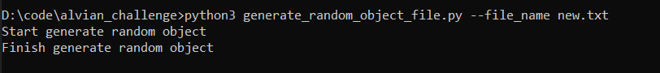
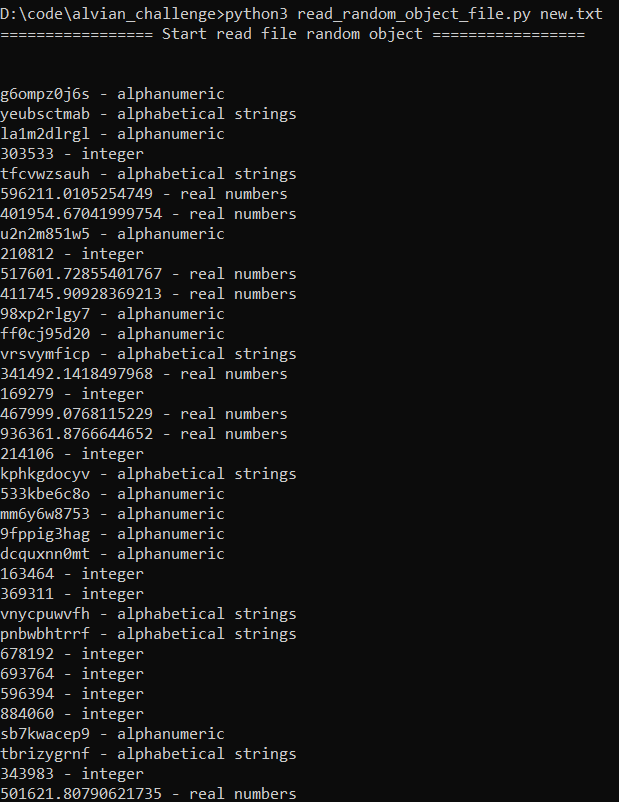
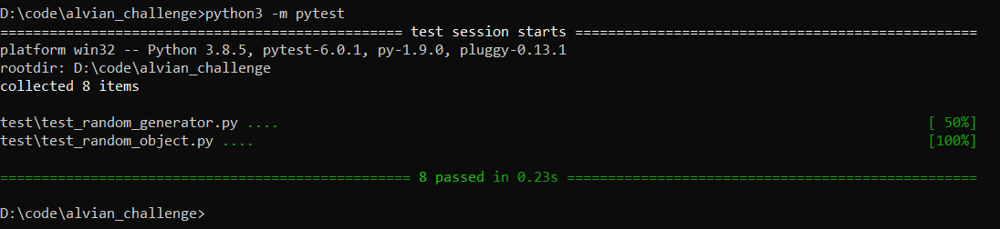

Programming Challenge - Omnylitics

Important:

This challenge consists of two (2) parts. You are required to complete both parts. You can use your preferred programming language. We strongly advise you not to refer to answers on the internet.

# Challenge A

  

Write a program that will generate four (4) types of printable random objects and store them in a single file, each object will be separated by a ",". These are the 4 objects: alphabetical strings, real numbers, integers, alphanumerics. The alphanumerics should contain a random number of spaces before and after it (not exceeding 10 spaces). The output should be 10MB in size.  
  
Sample extracted output:  
  
hisadfnnasd, 126263, assfdgsga12348fas, 13123.123,  
lizierdjfklaasf, 123192u3kjwekhf, 89181811238,122,  
nmarcysfa900jkifh , 3.781, 2.11, ....  
  

----------
## Preview

  
Challenge B

  

Create a program that will read the generated file above and print to the console the object and its type. Spaces before and after the alphanumeric object must be stripped.  
  
Sample output:  
  
youruasdifafasd - alphabetical strings  
127371237 - integer  
asdfka12348fas - alphanumeric  
13123.123 - real numbers  
asjdfklasdjfklaasf - alphabetical strings  
123192u3kjwekhf - alphanumeric

  
## Preview

-END-

requirement:
- python3

Before running:
- download this repo as zip
- extract the programming_challenge_omnylitics.zip file.
- open terminal and go to directory of this zip file and enter to programming_challenge_omnylitics folder.

How to run random object writer program:
1. open terminal on directory programming_challenge_omnylitics.
2. run: python3 generate_random_object_file.py [--file_name some_file_name.txt] (argument inside of "[]" means optional, default value is "random_object.txt").
3. check the generated file on the same folder.

How to run random object reader program:
1. open terminal on directory programming_challenge_omnylitics.
2. run: python3 read_random_object_file.py some_file_name.txt (file name is the name of file that contains random object which generated before and it is required).
3. the result will be printed on terminal.

Running test:
1. open terminal on directory programming_challenge_omnylitics.
2. run: python3 -m pytest
3. test result will be printed on terminal.

## Test Preview

